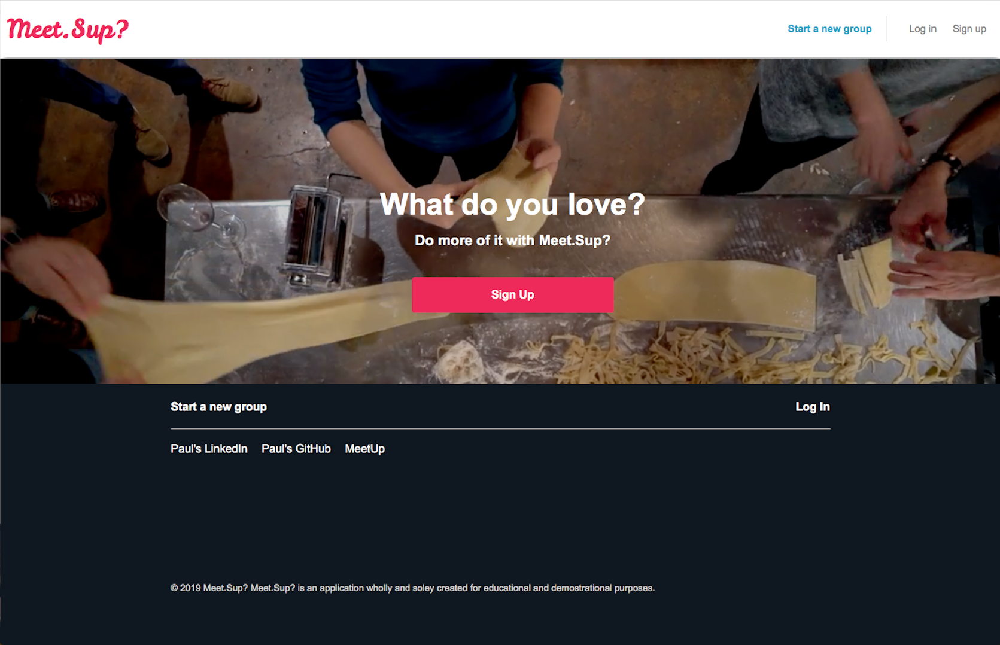
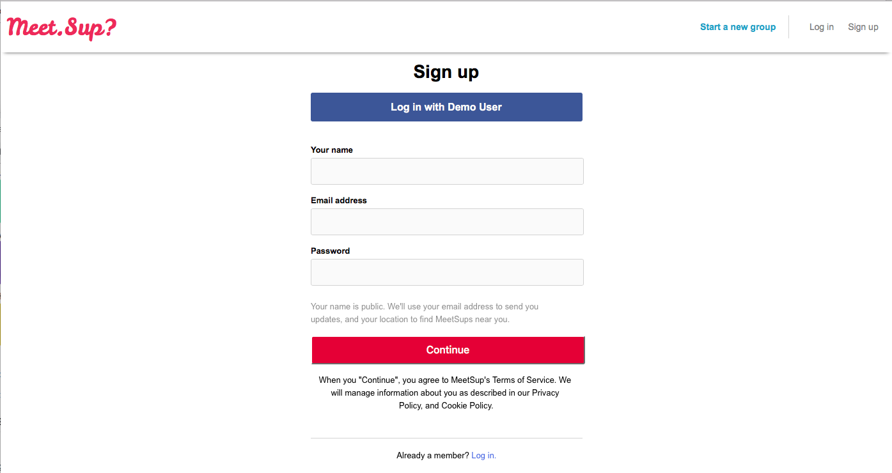
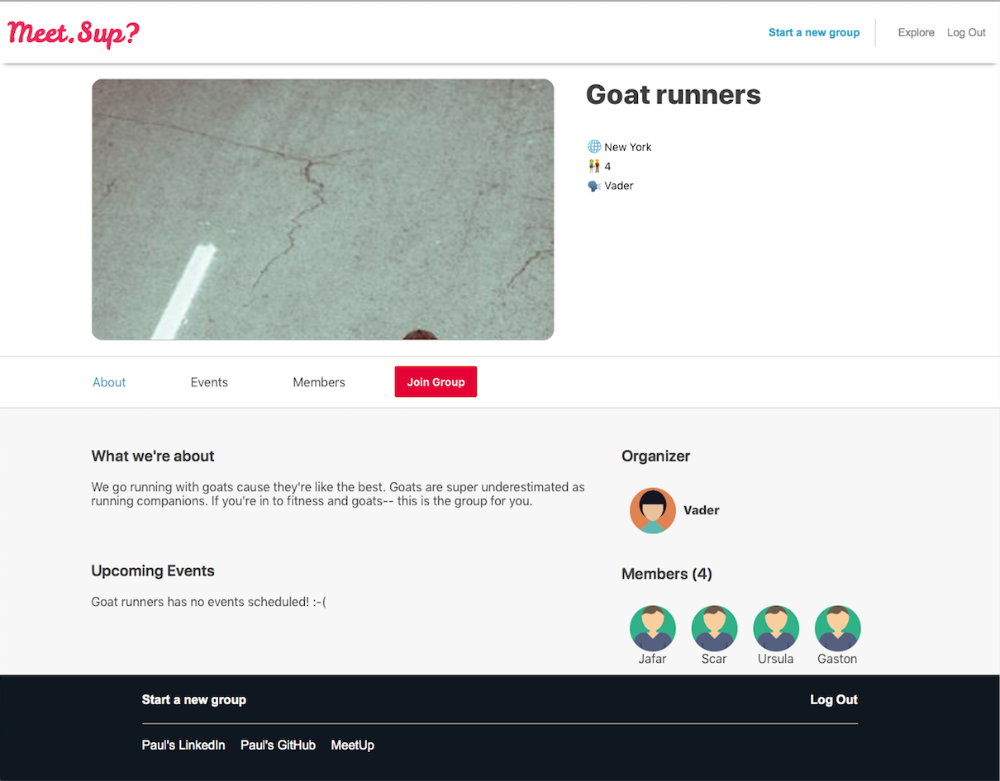
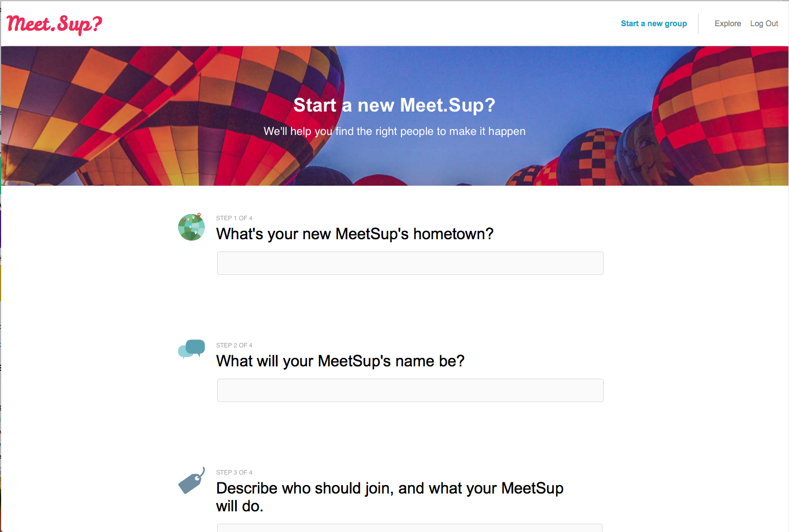

# Meet.Sup?
----------------------------------------------------------------------------------------------------------------------------
Welcome to my clone of the web's most popular site for connecting people with similar interests--[Meetup](www.meetup.com)!

## Design
----------------------------------------------------
This project was designed and implemented over the course of 10 days--from backend to frontend. Although additional features will be expanded upon after this initial period, core operations (including user authentication) are functional and styled!

## Features
-------------------------------------
A MeetSup user can:

*  Sign up, login and logout of their account (or utilize a demo user, if prefered)

*  View groups in their area 
*  See all relevant group information, including group description, its organizer and its members.

*  Choose to join or leave a group based on their current membership status
*  Start their own MeetSup!

## Technolgies and Implemenation
-------------------------------

### Backend:

* Ruby on Rails v. 5.1.6
* Postgres SQL managed databases
* Controllers rendering JSON 
* Jbuilder to structure relevant state information

### Frontend:

* Javascript using React/Redux
  * React Router
  * Navigation by pushing to history
* AJAX
* JQuery
* Babel gems for JSX transpilation

## Moving Forward
-------------------------------
Key features soon to be implemented:

* Event creation and RSVP by group members
* Image uploading
* User profiles & messaging capabilities

* In the meantime, enjoy Meet.Sup? and keep checking back for exciting updates!